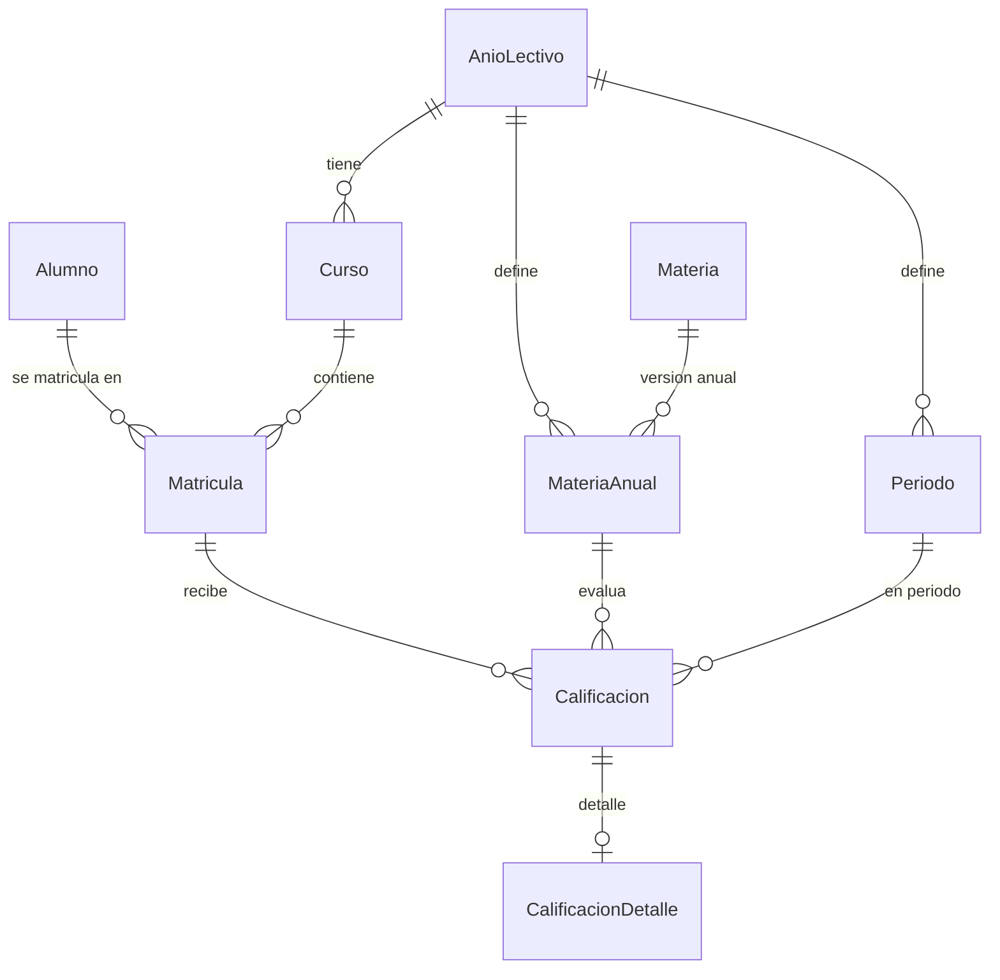

# Esquema de Base de Datos (`cole_db`)

Fuente oficial del esquema: `prisma/schema.prisma`.

## Componentes

### Tablas principales

#### `AnioLectivo`
- `id` (PK, autoincrement)
- `anio` (INT, UNIQUE)
- `estado` (`Estado`, default `BORRADOR`)
- `fechaInicio` (DATETIME, nullable)
- `fechaFin` (DATETIME, nullable)

#### `Alumno`
- `id` (PK, autoincrement)
- `apellido` (STRING)
- `nombre` (STRING)
- `dni` (STRING, UNIQUE)
- `activo` (BOOLEAN, default `true`)

#### `Curso`
- `id` (PK, autoincrement)
- `nombre` (STRING)
- `anioId` (FK -> `AnioLectivo.id`)

#### `Matricula`
- `id` (PK, autoincrement)
- `alumnoId` (FK -> `Alumno.id`)
- `cursoId` (FK -> `Curso.id`)

#### `Materia`
- `id` (PK, autoincrement)
- `codigoBase` (STRING, UNIQUE)
- `descripcion` (STRING, nullable)
- `activa` (BOOLEAN, default `true`)

#### `MateriaAnual`
- `id` (PK, autoincrement)
- `materiaId` (FK -> `Materia.id`)
- `anioId` (FK -> `AnioLectivo.id`)
- `nombre` (STRING)
- `cargaHoraria` (INT, nullable)
- Restriccion unica: `UNIQUE(materiaId, anioId)`

#### `Periodo`
- `id` (PK, autoincrement)
- `nombre` (STRING)
- `orden` (INT)
- `anioId` (FK -> `AnioLectivo.id`)
- Restriccion unica: `UNIQUE(anioId, orden)`

#### `Calificacion`
- `id` (PK, autoincrement)
- `matriculaId` (FK -> `Matricula.id`)
- `materiaAnualId` (FK -> `MateriaAnual.id`)
- `periodoId` (FK -> `Periodo.id`)
- `nota` (FLOAT)
- `fecha` (DATETIME, nullable)

#### `CalificacionDetalle`
- `id` (PK, autoincrement)
- `calificacionId` (FK UNIQUE -> `Calificacion.id`)
- `notaOrint1erTrim` (FLOAT, nullable)
- `nota1erTrimMes1` (FLOAT, nullable)
- `nota1erTrimMes2` (FLOAT, nullable)
- `nota1erTrimMes3` (FLOAT, nullable)
- `recup1erTrim` (FLOAT, nullable)
- `observ1erTrim` (TEXT, nullable)
- `notaOrint2doTrim` (FLOAT, nullable)
- `nota2doTrimMes1` (FLOAT, nullable)
- `nota2doTrimMes2` (FLOAT, nullable)
- `nota2doTrimMes3` (FLOAT, nullable)
- `recup2doTrim` (FLOAT, nullable)
- `observ2doTrim` (TEXT, nullable)
- `notaOrint3erTrim` (FLOAT, nullable)
- `nota3erTrimMes1` (FLOAT, nullable)
- `nota3erTrimMes2` (FLOAT, nullable)
- `nota3erTrimMes3` (FLOAT, nullable)
- `recup3erTrim` (FLOAT, nullable)
- `observ3erTrim` (TEXT, nullable)
- `acompDic` (TEXT, nullable)
- `acompFeb` (TEXT, nullable)
- `alumConAcomp` (TEXT, nullable)

#### `Usuario`
- `id` (PK, autoincrement)
- `username` (STRING, UNIQUE)
- `password` (STRING)
- `rol` (`Rol`)
- `activo` (BOOLEAN, default `true`)

#### `LogCambio`
- `id` (PK, autoincrement)
- `usuario` (STRING)
- `tablaAfectada` (STRING)
- `idRegistro` (INT)
- `tipoOperacion` (`Operacion`)
- `valorAnterior` (JSON, nullable)
- `valorNuevo` (JSON, nullable)
- `fecha` (DATETIME, default `now()`)

### Enums

#### `Estado`
- `BORRADOR`
- `ACTIVO`
- `CERRADO`

#### `Rol`
- `ADMIN`
- `DOCENTE`
- `DIRECTIVO`
- `REPRESENTANTE_LEGAL`
- `ADMINISTRATIVO`
- `PRECEPTOR`
- `ADMINISTRADOR_SISTEMA`
- `ALUMNO`
- `TUTOR_ALUMNO`

#### `Operacion`
- `INSERT`
- `UPDATE`
- `DELETE`

## Diagrama de relaciones (ER)

## Resumen de cardinalidades clave
- `AnioLectivo` 1:N `Curso`
- `AnioLectivo` 1:N `MateriaAnual`
- `AnioLectivo` 1:N `Periodo`
- `Alumno` 1:N `Matricula`
- `Curso` 1:N `Matricula`
- `Materia` 1:N `MateriaAnual`
- `Matricula` 1:N `Calificacion`
- `MateriaAnual` 1:N `Calificacion`
- `Periodo` 1:N `Calificacion`
- `Calificacion` 1:1 `CalificacionDetalle` (opcional del lado detalle)
